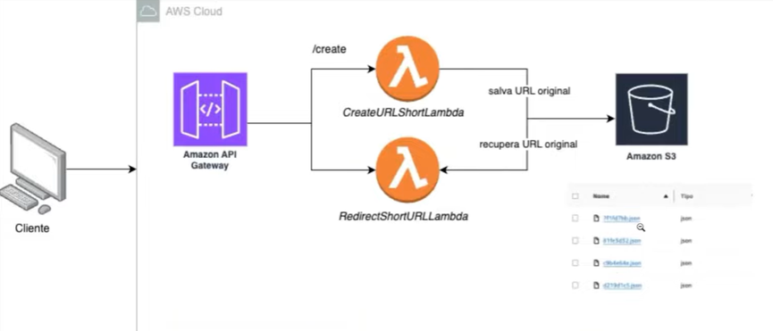

# Shortener-URL

Shortener-URL is a simple and scalable URL shortening service that utilizes Java, Spring, AWS Lambda, AWS S3, and Amazon API Gateway. The service allows users to shorten URLs and then redirect them when accessed using the shortened version.

## Architecture Overview



The system is built around a serverless architecture with the following components:

1. **Amazon API Gateway**: Acts as the entry point for client requests. The API Gateway routes requests to the appropriate AWS Lambda functions.
2. **AWS Lambda Functions**:
   - **CreateURLShortLambda**: Generates a unique UUID for the URL, stores it along with the original URL and expiration time in Amazon S3.
   - **RedirectShortURLLambda**: Retrieves the original URL based on the UUID from Amazon S3 and redirects the user to the original URL if it exists.
3. **Amazon S3**: Used for persistent storage of shortened URL mappings (UUID to original URL, along with expiration data).

## Features

- Shorten long URLs into a unique identifier (UUID).
- Expiration time for shortened URLs.
- Redirect users to the original URL when they access the shortened URL.
- Serverless, scalable architecture using AWS Lambda.
- Integration with AWS S3 for persistent URL storage.

## Technologies Used

- **Java**: Programming language used to implement the logic in AWS Lambda functions.
- **Spring**: Framework used for building the backend logic in the Lambda functions.
- **AWS Lambda**: Serverless compute service to handle URL shortening and redirection logic.
- **Amazon S3**: Object storage service to store mappings between shortened URLs and their corresponding original URLs.
- **Amazon API Gateway**: Acts as a front-facing API for the system, routing requests to AWS Lambda functions.

## Architecture Diagram

```
Client Request -> API Gateway -> [CreateURLShortLambda / RedirectShortURLLambda] -> S3 (URL Mappings)
```

## Getting Started

### Prerequisites

To run this project locally or deploy it to AWS, you'll need:

- AWS Account
- AWS CLI configured with proper IAM roles for Lambda and S3 access
- Java Development Kit (JDK) installed (version 8 or higher)
- Maven for building and packaging the project
- An IDE for Java development (such as IntelliJ IDEA or Eclipse)

### Project Setup

1. **Clone the Repository**:
   ```bash
   git clone https://github.com/raphaelsrcunha/shortener-url.git
   cd shortener-url
   ```

2. **Build the Project**:
   Use Maven to compile and package the project.
   ```bash
   mvn clean install
   ```

3. **Deploy to AWS**:
   Deploy the AWS Lambda functions and API Gateway using the AWS CLI or AWS Management Console. You can also automate this using AWS CloudFormation or the Serverless Framework.

4. **Configure S3 Bucket**:
   Create an S3 bucket for storing URL mappings. Ensure the Lambda functions have proper permissions to read and write to this bucket.

5. **API Gateway Configuration**:
   Create an API in Amazon API Gateway to handle incoming requests. Configure two endpoints:
   - `/create`: For creating a shortened URL.
   - `/redirect/{uuid}`: For redirecting to the original URL based on the shortened UUID.

### API Endpoints

- **POST /create**: Accepts a JSON payload with the original URL and expiration time and returns the shortened URL (UUID).
  - Example Request:
    ```json
    {
      "originalUrl": "https://example.com",
      "expirationTime": "2024-12-31T23:59:59"
    }
    ```
  - Example Response:
    ```json
    {
      "shortenedUrl": "https://your-api-gateway-url/create/abc123"
    }
    ```

- **GET /redirect/{uuid}**: Redirects the user to the original URL based on the provided UUID.
  - Example Request:
    ```http
    GET /redirect/abc123
    ```
  - Example Response:
    Redirects to the original URL (`https://example.com`).

### Lambda Function Logic

1. **CreateURLShortLambda**:
   - Generates a UUID for the provided URL.
   - Stores the mapping between the UUID and the original URL in Amazon S3, along with an expiration timestamp.

2. **RedirectShortURLLambda**:
   - Receives the UUID from the request.
   - Checks if the UUID exists in the S3 bucket.
   - If it exists, returns the original URL for redirection.
   - If the UUID does not exist or is expired, returns a 404 error.

## Deployment

1. Package the project and deploy the Lambda functions using AWS Lambda Console or AWS CLI.
2. Set up Amazon API Gateway with the proper routing to trigger the Lambda functions.
3. Create an S3 bucket to store URL mappings and configure access permissions.

## Contributing

We welcome contributions to this project! If you'd like to contribute, please fork the repository, create a new branch, and submit a pull request with your changes. Make sure to include tests for any new functionality and ensure that the existing tests pass.

## License

This project is licensed under the MIT License - see the [LICENSE](LICENSE) file for details.

## Acknowledgements

- AWS for providing the powerful services (Lambda, S3, API Gateway) that make this architecture possible.
- Spring for providing a framework that simplifies backend development in Java.
